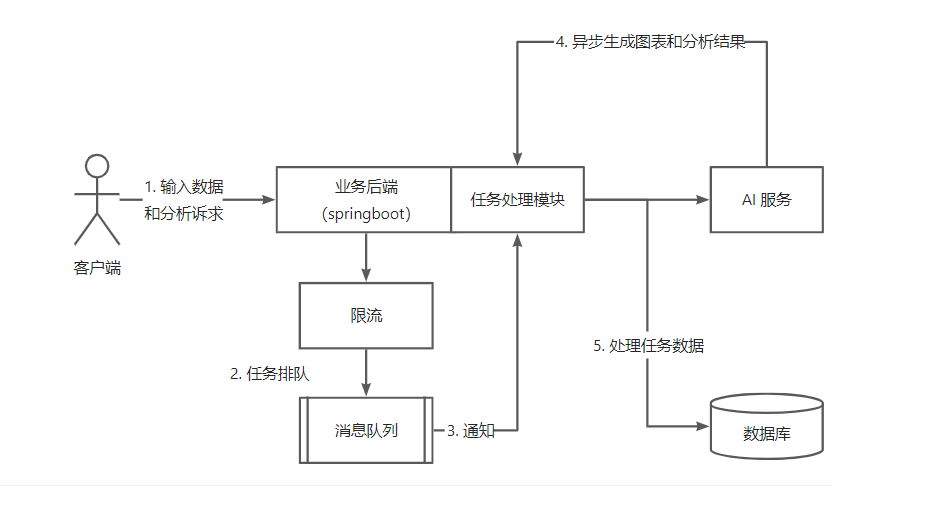
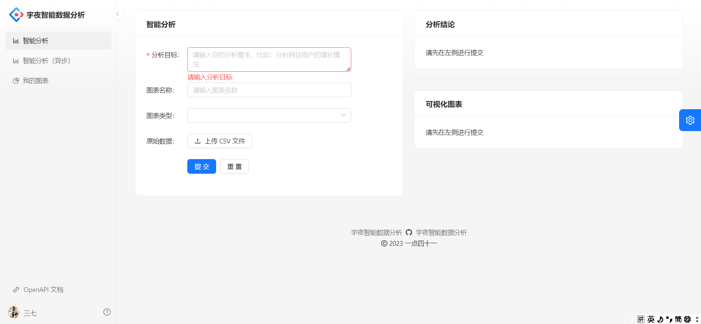

# 宇夜智能数据分析

## 项目介绍

> 访问 swagger 地址 = http://localhost:9394/api/doc.html

    基于 Spring Boot + MQ + AIGC+ React 的智能数据分析平台。区别于传统 BI，用户只需要导入原始数据集、并输入分析诉求，就能自动生成可视化图表及分析结论，实现数据分析的降本增效。可作为单独接口提供给

1. 业务流程: 后端自定义 Prompt 预设模板并封装用户输入的数据和分析诉求，通过对接 AIGC 接口生成可视化图表 ison
   配置和分析结论，返回给前端渲染。
2. 由于 AIGC 的输入 Token 限制，使用 Easy Excel 解析用户上传的 XLSX 表格数据文件并压缩为 CSV，实测提高了 20%
   的单次输入数据量、并节约了成本
3. 为保证系统的安全性，对用户上传的原始数据文件进行了后缀名、大小、内容等多重校验,对上传内容进行敏感词校验过滤铭感词。
4. 为防止某用户恶意占用系统资源，基于 Redisson 的 RateLimiter 实现分布式限流，控制单用户访问的频率。
5. 考虑到单个图表的原始数据量较大，基于 MvBatis + 业务层构建自定义 SQL 实现了对每份原始数据的分表存储，提高查询性能和系统的可扩展性。
6. 由于 AIGC 的响应时间较长，基于自定义 IO 密集型线程池+ 任务队列实现了 AIGC
   的并发执行和异步化，提交任务后即可响应前端，提高用户体验。
7. 由于本地任务队列重启丢失数据，使用 RabbitMQ来接受并持久化任务消息，通过Direct 交换机转发给解耦的 AI
   生成模块消费并处理任务，提高了系统的可靠性。

#### 可扩展点

1. 支持用户查看图表原始数据 √ sanqi
2. 图表数据分表存储，提高查询灵活性和性能 √ sanqi
3. 支持分组 (分标签) 查看和检索图表
4. 增加更多可选参数来控制图表的生成，比如图表配色等
5. 支持用户对失败的图表进行手动重试
6. 限制用户同时生成图表的数量，防止单用户抢占系统资源
7. 统计用户生成图表的次数，甚至可以添加积分系统，消耗积分来智能分析
8. 支持编辑生成后的图表的信息。比如可以使用代码编辑器来编辑 Echarts 图表配置代码
9. 由于图表数据是静态的，很适合使用缓存来提高加载速度
19. 使用死信队列来处理异常情况，将图表生成任务置为失败
11. 补充传统 BI 拥有的功能，把智能分析作为其中一个子模块
12. 给任务的执行增加 guava Retrying 重试机制，保证系统可靠性 √ sanqi
13. 提前考虑到 AI 生成错误的情况，在后端进行异常处理(比如 AI 说了多余的话，提取正确的字符串) √ sanqi
14. 如果说任务根本没提交到队列中(或者队列满了)，是不是可以用定时任务把失败状态的图表放到队列中(补偿机制建立)
15. 建议给任务的执行增加一个超时时间，超时自动标记为失败 (超时控制)
16. 反向压力: https://zhuanlan.zhihu.com/p/404993753，通过调用的服务状态来选择当前系统的策略(比如5根据 AI
    服务的当前任务队列数来控制咱们系统的核心线程数)，从而最大化利用系统资源。
17. 我的图表页面增加一个刷新、定时自动刷新的按钮，保证获取到图表的最新状态(前端轮询)
18. 任务执行成功或失败，给用户发送实时消息通知(实时: websocket、server side event)
19. 使用 Redis 存储用户登录的分布式 Session，实现多机用户登录状态同步 √ sanqi
20. 将敏感词校验抽成独立的微服务,编写 SDK 单独作为微服务通过远程调用的形式完成铭感词校验,可以加入放接口项目实现解耦复用和线上调用
21. 摘除冗余功能独立为另一个微服务
22. 引入新的 ai 模型如 openAI 我记的国内有一个二次封装的Ai也有免费的 AK,SK 还有嗯我记得之前有过 AI 共享的那种,可以考虑学习那种机制
23. 引入框架 优化分表逻辑 https://shardingsphere.apache.org/document/4.1.0/cn/manual/sharding-jdbc/
    

## 架构图

## 代码优化工作

开发时为了快速代码堆积到控制层,需要对其进行分层,目前部分接口已经改造完毕

## 效果图

## 技术集成

- Spring Boot 2.7.x（贼新）
- Spring MVC
- MyBatis + MyBatis Plus 数据访问（开启分页）
- Spring Boot 调试工具和项目处理器
- Spring AOP 切面编程
- Spring Scheduler 定时任务
- Spring 事务注解

### 数据存储

- MySQL 数据库
- Redis 内存数据库
- Elasticsearch 搜索引擎
- 腾讯云 COS 对象存储

### 工具类

- Easy Excel 表格处理
- Hutool 工具库
- Gson 解析库
- Apache Commons Lang3 工具类
- Lombok 注解

### 业务特性

- Spring Session Redis 分布式登录
- 全局请求响应拦截器（记录日志）
- 全局异常处理器
- 自定义错误码
- 封装通用响应类
- Swagger + Knife4j 接口文档
- 自定义权限注解 + 全局校验
- 全局跨域处理
- 长整数丢失精度解决
- 多环境配置

## 业务功能

- 提供示例 SQL（用户、帖子、帖子点赞、帖子收藏表）
- 用户登录、注册、注销、更新、检索、权限管理
- 支持微信开放平台登录
- 支持微信公众号订阅、收发消息、设置菜单
- 支持分业务的文件上传

### 单元测试

- JUnit5 单元测试
- 示例单元测试类

### 架构设计

- 合理分层
